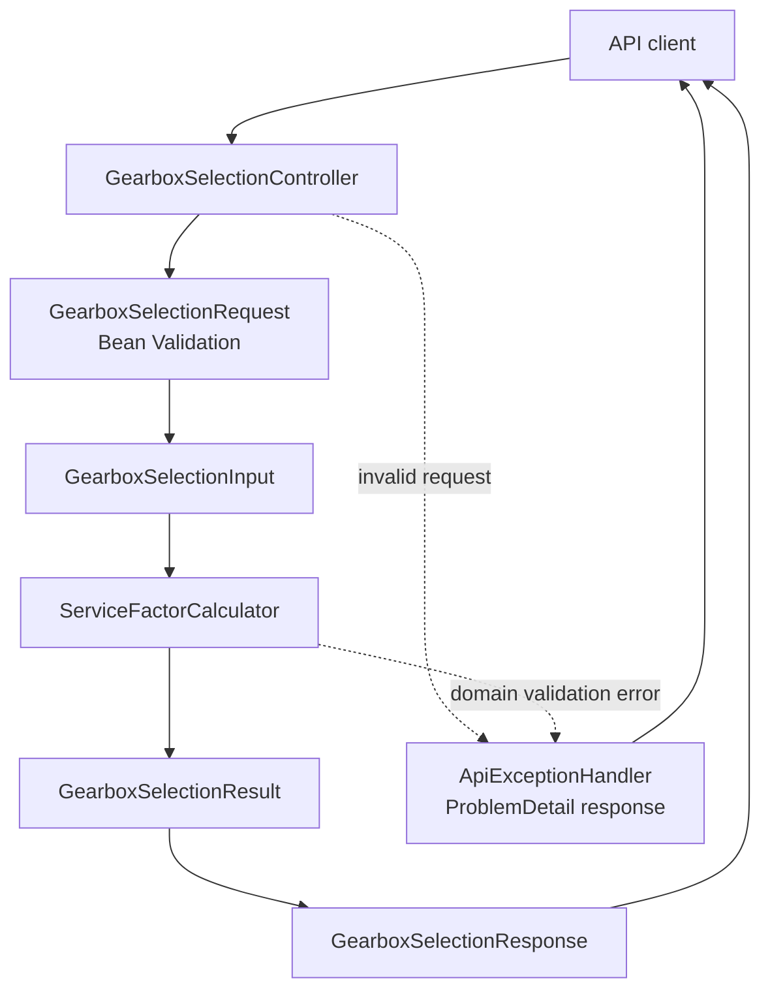

# Architecture Overview

This document explains the main structure of the Industrial Gearbox Sizing & Service Factor API.

The application is intentionally small, but it separates API handling, validation, domain calculation, configuration, documentation, and quality gates so that the screening logic remains testable and reviewable.

## High-Level Flow

## Main Layers

| Layer | Main files | Responsibility |
|---|---|---|
| API layer | `GearboxSelectionController`, `GearboxSelectionRequest`, `GearboxSelectionResponse` | Exposes the REST endpoint, receives validated input, and returns structured API responses. |
| Error handling | `ApiExceptionHandler` | Converts validation, malformed JSON, and domain validation errors into ProblemDetail responses. |
| Domain layer | `ServiceFactorCalculator`, `GearboxSelectionInput`, `GearboxSelectionResult`, `FactorBreakdown` | Calculates reduction ratio, generic service factor, design torque, factor breakdowns, selection reasons, and risk notes. |
| Configuration | `GearboxConfiguration` | Keeps calculator wiring explicit and simple. |
| Health endpoints | `HealthController` | Provides deployment health checks through `/` and `/health`. |
| API documentation | `OpenApiConfiguration`, OpenAPI annotations | Exposes OpenAPI JSON and Swagger UI for API inspection. |
| Quality gates | JUnit, MockMvc, JaCoCo, Docker, GitHub Actions | Verifies domain logic, boundary behavior, API behavior, coverage threshold, Docker build, and CI smoke testing. |

## Request Handling

The API receives gearbox operating conditions such as load type, operating hours, start-stop frequency, shock level, torque, speed, and ambient temperature.

Bean Validation handles unsafe or invalid request values before the request reaches the domain calculation layer.

The request DTO is then converted into a domain input object so that the calculation logic can remain independent from HTTP-specific concerns.

## Domain Calculation

The domain layer calculates:

* reduction ratio
* generic service factor
* design torque
* factor breakdown
* selection reasons
* risk notes
* diagnosis message

The service factor model is intentionally generic and documented separately in [Calculation Model](CALCULATION_MODEL.md).

Manufacturer-specific catalog data, model-number recommendations, dimensional databases, and certified mechanical validation are outside the current scope.

## Error Handling

Invalid API inputs are returned as `application/problem+json` responses.

The exception handler covers:

* Bean Validation errors
* malformed JSON or invalid enum values
* domain validation errors

This keeps error responses predictable for API users and prevents domain validation failures from becoming unexpected server errors.

## Quality and Verification

The project is verified with:

* Java domain tests
* boundary tests for duty-cycle, start-stop, and ambient-temperature thresholds
* MockMvc API tests
* OpenAPI documentation tests
* JaCoCo coverage verification with an 80% minimum threshold
* Docker image build verification
* GitHub Actions CI
* API smoke testing

The boundary tests are especially important because small changes around threshold values can affect service factor, design torque, selection status, and risk notes.

## Current Scope

This project is a generic engineering screening API.

It is not a replacement for manufacturer selection software, certified engineering review, or project-specific mechanical design checks.

Final reducer selection must always be verified against official manufacturer documentation.
